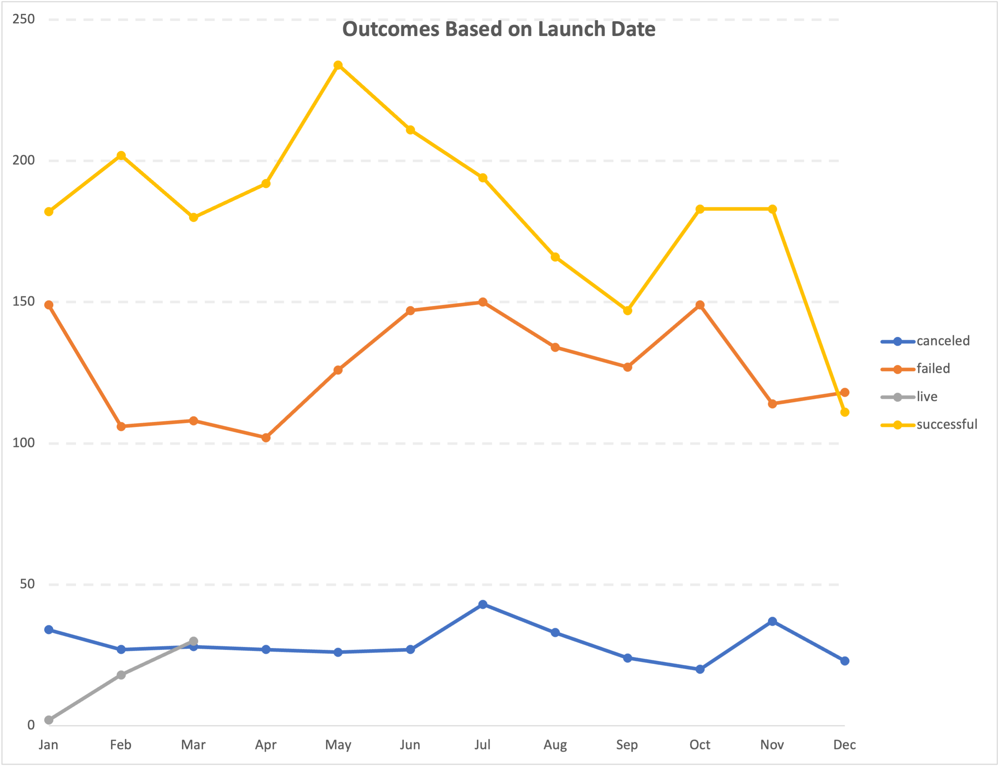

# An Analysis of Kickstarter Campaigns

This is a project to analyse crowdfunding data to determine specific factors that make a campaign successful.
It is the case of study in Module 1 of Rutgers Data Science Bootcamp 2021, and it uses EXCEL to organize and process data, as well as, to present insights.
  
The following charts show how succesful campaigns are depending on the date they were launch   and the kind of campaign that it is [Figure 2](ParentOutcomes_Crowdfunding.png)

